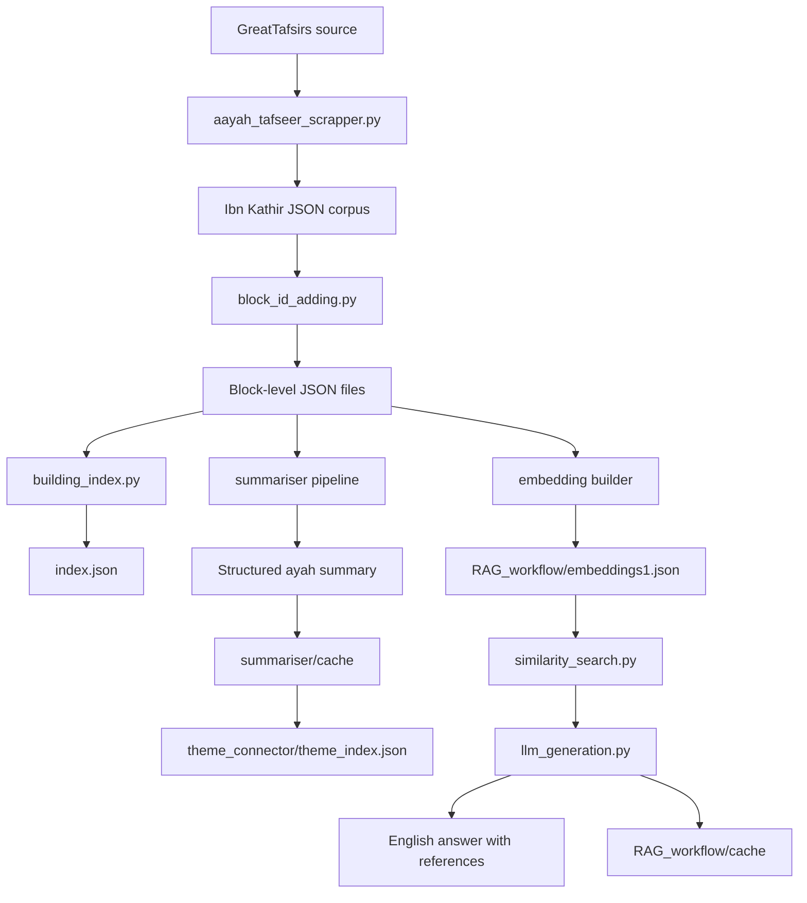
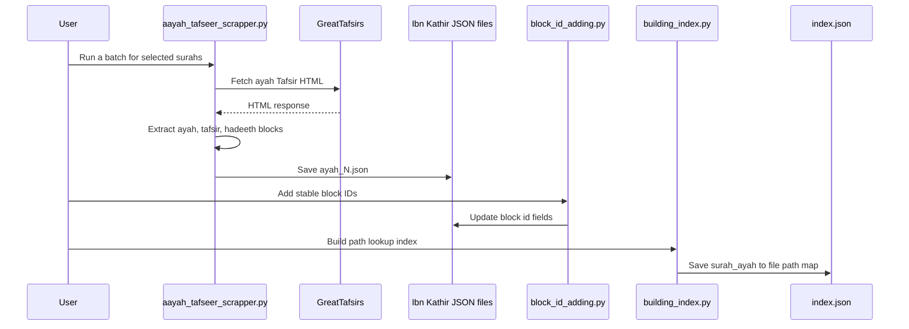

# TafseerU

TafseerU is a Python-based Tafsir research workflow for building, indexing, summarising, and querying ayah-level Tafsir data. It currently works with a local JSON corpus of Ibn Kathir Tafsir files and provides two main capabilities:

- Direct ayah summarisation with structured themes and a reader-friendly English summary.
- Retrieval-Augmented Generation (RAG) question answering over embedded Tafsir blocks.

The project is designed for research and learning use: it keeps the Tafsir text in transparent JSON files, builds searchable indexes, and uses OpenAI models for summarisation and question answering.

## Table of Contents

- [Project Highlights](#project-highlights)
- [Repository Structure](#repository-structure)
- [Architecture](#architecture)
- [Data Flow](#data-flow)
- [Setup](#setup)
- [Usage](#usage)
- [How The Main Modules Work](#how-the-main-modules-work)
- [Configuration](#configuration)
- [What To Commit To GitHub](#what-to-commit-to-github)
- [What Not To Commit](#what-not-to-commit)
- [Publishing To GitHub](#publishing-to-github)
- [Roadmap](#roadmap)
- [Important Notes](#important-notes)

## Project Highlights

- Local JSON Tafsir corpus arranged by `surah` and `ayah`.
- Scraper utility for collecting Tafsir data in batches.
- Block-level IDs for every extracted Tafsir, ayah, and hadeeth block.
- Index builder for fast ayah file lookup.
- OpenAI-powered structured ayah summarisation.
- Theme extraction and theme index generation from cached summaries.
- RAG pipeline using OpenAI embeddings and cosine similarity.
- Cache layer for RAG answers and summary outputs to reduce repeated API calls.

## Repository Structure

```text
TafseerU_building/
|-- Ibn Kathir/                         # Local Tafsir JSON corpus
|   |-- surah_1/
|   |   |-- ayah_1.json
|   |   |-- ...
|   |-- ...
|-- RAG_workflow/
|   |-- pipeline.py                     # CLI entry point for RAG Q&A
|   |-- llm_generation.py               # Builds context and calls the LLM
|   |-- similarity_search.py            # Cosine similarity search
|   |-- test_embedding.py               # Builds and loads embeddings
|   |-- cache.py                        # Query cache helpers
|   |-- __init__.py
|-- summariser/
|   |-- summarise_pipeline.py           # CLI entry point for ayah summaries
|   |-- llm_call.py                     # Uploads ayah JSON and calls the LLM
|   |-- prompt_desing.py                # Prompt template for summarisation
|   |-- data_loader.py                  # Loads local ayah JSON files
|-- theme_connector/
|   |-- theme_index.py                  # Builds a theme-to-ayah index
|   |-- __init__.py
|-- aayah_tafseer_scrapper.py           # Batch Tafsir scraper
|-- block_id_adding.py                  # Adds stable IDs to JSON blocks
|-- building_index.py                   # Builds index.json for ayah files
|-- index.json                          # Generated ayah file index
|-- requirements.txt                    # Python dependencies
|-- .gitignore                          # Files excluded from Git
|-- README.md                           # Project documentation
```

## Architecture



## Data Flow

### 1. Dataset Building Flow



### 2. Summarisation Flow


### 3. RAG Question Answering Flow


## Setup

### 1. Create a virtual environment

```powershell
python -m venv .venv
.\.venv\Scripts\Activate.ps1
```

### 2. Install dependencies

```powershell
python -m pip install -r requirements.txt
```

### 3. Set your OpenAI API key

```powershell
$env:OPENAI_API_KEY="your_api_key_here"
```

For a persistent Windows user-level environment variable:

```powershell
setx OPENAI_API_KEY "your_api_key_here"
```

Restart your terminal after using `setx`.

## Usage

Run commands from the repository root.

### Summarise a single ayah

```powershell
python summariser\summarise_pipeline.py 1 1
```

This loads:

```text
Ibn Kathir/surah_1/ayah_1.json
```

Then it sends the JSON file to the configured OpenAI model and returns:

- Main themes of the ayah.
- A clear English summary.
- Cached output for future calls.
- A refreshed theme index.

### Ask a RAG question

```powershell
python RAG_workflow\pipeline.py "What does Ibn Kathir say about guidance in Surah Al-Fatihah?"
```

The RAG pipeline:

1. Loads existing embeddings from `RAG_workflow/embeddings1.json` or `RAG_workflow/embeddings.json`.
2. Embeds the user query.
3. Finds the most similar Tafsir blocks using cosine similarity.
4. Expands retrieved blocks into ayah-level context.
5. Generates an English answer with references.
6. Stores cache entries for repeated or similar questions.

### Build embeddings

```powershell
python RAG_workflow\test_embedding.py
```

Current implementation builds embeddings from:

```text
Ibn Kathir/surah_1
```

The output is written to:

```text
RAG_workflow/embeddings1.json
```

### Build the ayah index

```powershell
python building_index.py
```

This creates or refreshes `index.json`, mapping each `surah_ayah` key to its local JSON file path.

### Add block IDs to corpus files

```powershell
python block_id_adding.py
```

This updates JSON blocks that do not already have an `id`, using this format:

```text
<surah>_<ayah>_<block_type>_b<block_number>
```

### Scrape Tafsir data

```powershell
python aayah_tafseer_scrapper.py
```

Before running it, edit the final line in `aayah_tafseer_scrapper.py`:

```python
run_scraper(25, 25)
```

Change the surah range gradually so you do not overload the source website.

## How The Main Modules Work

| Module | Purpose |
| --- | --- |
| `aayah_tafseer_scrapper.py` | Fetches Tafsir HTML, extracts relevant blocks, and stores ayah-level JSON files. |
| `block_id_adding.py` | Adds stable block IDs to each JSON block for retrieval and referencing. |
| `building_index.py` | Builds `index.json`, a simple lookup table from `surah_ayah` to file path. |
| `summariser/data_loader.py` | Loads JSON data and file paths from the local corpus. |
| `summariser/prompt_desing.py` | Defines the prompt template for structured ayah summaries. |
| `summariser/llm_call.py` | Sends ayah JSON to OpenAI, caches the summary, and updates the theme index. |
| `summariser/summarise_pipeline.py` | CLI wrapper for summarising a single ayah. |
| `theme_connector/theme_index.py` | Builds a reverse index from summary themes to ayah references. |
| `RAG_workflow/test_embedding.py` | Builds and loads block embeddings. |
| `RAG_workflow/similarity_search.py` | Computes cosine similarity and returns top matching blocks. |
| `RAG_workflow/llm_generation.py` | Builds RAG context and generates the final answer. |
| `RAG_workflow/cache.py` | Stores exact and similarity-based cache entries for RAG queries. |
| `RAG_workflow/pipeline.py` | CLI wrapper for asking RAG questions. |

## Configuration

| Variable | Default | Purpose |
| --- | --- | --- |
| `OPENAI_API_KEY` | Required | API key used for embeddings, summaries, and RAG answers. |
| `OPENAI_CHAT_MODEL` | `gpt-5.4` | Model used by the summariser. |
| `DEBUG_PROMPT` | Off | Set to `1`, `true`, `yes`, or `on` to print retrieved RAG context and the final prompt. |
| `RAG_CACHE_SIMILARITY_THRESHOLD` | `0.92` | Similarity threshold for reusing cached RAG answers. |

Example:

```powershell
$env:DEBUG_PROMPT="1"
$env:RAG_CACHE_SIMILARITY_THRESHOLD="0.90"
python RAG_workflow\pipeline.py "Explain the opening of Surah Al-Fatihah"
```

## What To Commit To GitHub

Recommended files to push:

```text
README.md
.gitignore
requirements.txt
aayah_tafseer_scrapper.py
block_id_adding.py
building_index.py
index.json
Ibn Kathir/
RAG_workflow/__init__.py
RAG_workflow/cache.py
RAG_workflow/llm_generation.py
RAG_workflow/pipeline.py
RAG_workflow/similarity_search.py
RAG_workflow/test_embedding.py
summariser/data_loader.py
summariser/llm_call.py
summariser/prompt_desing.py
summariser/summarise_pipeline.py
theme_connector/__init__.py
theme_connector/theme_index.py
```

Optional files to push:

- `RAG_workflow/embeddings1.json` and `RAG_workflow/embeddings.json` if you want the repository to include precomputed embeddings. They are generated files and can be large, so the default `.gitignore` excludes them.
- `theme_connector/theme_index.json` if you want to publish a prebuilt theme index. It is generated from summariser cache files, so the default `.gitignore` excludes it.

## What Not To Commit

Do not push:

```text
__pycache__/
*.pyc
.venv/
.env
summariser/cache/
RAG_workflow/cache/
RAG_workflow/embeddings*.json
theme_connector/theme_index.json
```

Why:

- `__pycache__` and `*.pyc` are generated Python bytecode.
- `.venv` is your local virtual environment.
- `.env` can contain private API keys.
- `summariser/cache` and `RAG_workflow/cache` are generated local outputs.
- Embedding JSON files can be regenerated and may become large.
- `theme_index.json` is generated from cached summaries.

## Publishing To GitHub

Install Git first if `git` is not available in your terminal.

### 1. Check the files

```powershell
git status
```

### 2. Initialize the repo if needed

```powershell
git init
```

### 3. Add the safe files

```powershell
git add README.md .gitignore requirements.txt
git add aayah_tafseer_scrapper.py block_id_adding.py building_index.py index.json
git add "Ibn Kathir"
git add RAG_workflow summariser theme_connector
git status
```

Because `.gitignore` excludes caches, bytecode, embeddings, and private env files, `git add RAG_workflow summariser theme_connector` should only stage the safe source files.

### 4. Commit

```powershell
git commit -m "Initial TafseerU project"
```

### 5. Connect your GitHub repository

Create an empty repository on GitHub, then run:

```powershell
git branch -M main
git remote add origin https://github.com/YOUR_USERNAME/YOUR_REPOSITORY_NAME.git
git push -u origin main
```

If you already connected a remote:

```powershell
git remote -v
git push -u origin main
```

## Roadmap

- Rename `prompt_desing.py` to `prompt_design.py` and update imports.
- Move scraper run configuration behind a CLI argument instead of editing the file manually.
- Add tests for data loading, indexing, cache behaviour, and cosine similarity.
- Add a command-line option for choosing the embedding source surah range.
- Add a small sample dataset mode for lightweight demos.
- Add license and source attribution details before public release.

## Important Notes

- This project depends on an OpenAI API key for summarisation, embeddings, and RAG generation.
- Verify source licensing and attribution requirements before publishing the full Tafsir corpus publicly.
- Keep API keys out of GitHub.
- Review generated summaries manually before using them in educational or public-facing contexts.
